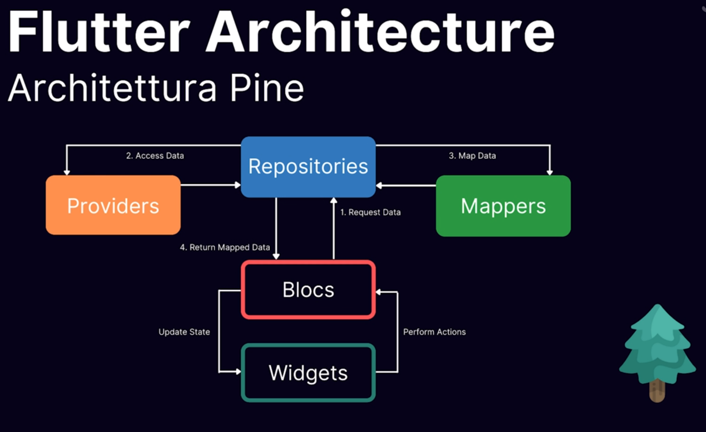

# Pine

Pine è un pattern architetturale ideato da un mio amico, in pine gli elementi sono organizzati **gerarchicamente** e si scambiano informazioni seguendo una precisa direzione. Ha un suo package ma sostanzialmente è vuoto, ha solo delle classi per gestire la DI secondo la gerarchia che vedremo più avanti. Sempre lui, Angelo Cassano ha fatto diversi altri package flutter molto utili, come `flutter_flavorizr` e `data_fixture_dart` (estremamente utile in fase di test)

## Packages utilizzati

### provider

Pine utilizza Provider per quanto concerne la **DI** (provider semplifica l'inniezione che andrebbe altrimenti fatta con inherited widget); Provider funge anche da **service locator** andando a recuperare le istanze degli elementi inniettati nell'albero dei widget.

### flutter_bloc

Pattern di state management che si occupa di **eliminare l'accoppiamento** tra il layer UI ed il layer di business.

Mette in comunicazione il layer di UI sottoscrivendosi alla ricezione di eventi. Gli eventi (scatenati dalla UI) scatenano l'esecuzione di logica di business, gestita dai layer sottostanti. lato BLoC è possibile emettere una serie di stati per restituire un feedback al layer UI.

### freezed (fortemente consigliato)

Permette di creare agevolmente classi con vari metodi utili come copyWith, when, toJson e fromJson automaticamente specificando solo la struttura della classe.

### retrofit (opzionale)

Permette di serializzare e deserializzare automaticamente i DTO facendo richieste http

### auto_route (opzionale)

Permette sempre tramite code gen di creare facilmente cose come le rotte di Navigator 2.0, le guardie, le sotto rotte e così via

## Tipologie di componenti

- Mappers
- Providers
- Repositories
- BLoCs

### Relazioni

partiamo dallo strato più alto dell'architettura, i widget.
Esempio: 
L''utente preme un bottone, il tap scatena l'emissione di un evento verso un BLoC (ipotiziamo per esempio che l'azione voluta sia quella di scaricare una lista di dati dal web da mostrare all'interno della schermata).

Alla ricezione dell'evento il BLoC prima di tutto comunica alla UI che è in fase di caricamento (la UI in base allo stato del BLoC mostra a sua volta uno spinner ad esempio). Nel frattempo il bloc andrà ad interrogare il layer che si occupa di recuperare i dati: il **Repository layer**, questo layer fa da passacarte ed invia la richiesta ad un servizio (questo per poter agevolmente refactorare il layer dei providers, sottostante a quello delle repositories, **senza dover refactorare tutti gli altri** layer). Il layer delle repository si occupa poi di trasformare il formato dei dati ottenuti dal service tramite i Mapper (questo per poter facilmente modificare la struttura dei dati server/locali senza stravolgere gli altri layer, ma gestendo le modifiche a livello di mapper). Una volta fatto questo il BLoC comunica lo stato di successo o di fallimento alla UI.

## I Data Transfer Objects

Sono particolari classi usate a livello di business per veicolare le informazioni da un layer all'altro, simili ai Models ed alle Entities. Ad esempio un DTO di una classe restituita da un API rest si occupa di far comunicare il layer dei service network con il layer repository tramite l'utilizzo dei mapper

## Il pattern mapper

All'interno dell'applicazione non tutti gli elementi del JSON vengono usati, quindi è ragionevole trasformare ad esempio un oggetto UserDTO in User. 
Perchè non costruire direttamente un DTO che contiene solo le informazioni che ci servono?

- Per **semplificare**: Perchè spesso chi si occupa di front non ha controllo sul back, e se il backend prevede ad esempio una struttura ricorsiva particolare per accedere a un dato è necessario fare dei giri che tramite mapper potremmo risparmiarci mappando l'oggetto in un secondo momento.
- Per **generalizzare**: Ad esempio se ho due schermate che fanno un uso diverso dei DTO può essere lecito mappere i DTO in classi differenti. Ad esempio il DTO contiene informazioni davvero molto corpose (50 campi) e le pagine di destinazione ne usano solo 6 differenti.
- Per **astrarre**: Se la sorgente dei dati dovesse cambiare da una sorgente di dati ad un altra con i mapper noi manteniamo la struttura integra basandosi su dei modelli interni, basterà modificare opportunamente iu mapper ed i services.

## Il pattern repository

Il pattern repository è un design pattern dell'ingegneria del SW che consente di disaccoppiare l'accesso al layer dei dati rispetto al layer di presentation. Se ad esempio dopo aver fatto la get delle risorse online volessimo anche memorizzare essi in una base di dati locale senza repositories dovremmo far comunicare il bloc con n servizi che si occupano di fare queste n cose, accoppiando fortemente i bloc alla business logic, con una repository la logica resta disaccoppiata e facilmente refactorabile. 
Vantaggi:

- Accesso centralizzato ai dati evitando la duplicazione del codice
- Codice più facilmente manutenibile e testabile grazie al disaccoppiamento
- Sorgenti dati facilmente intercambiabili

## Capitolo bonus: i brick
Mason è una utility sviluppata dal creatore di bloc, è un generatore di **template** dinamico, può essere usato per creare le proprie **strutture boilerplate** usate spesso nel proprio workflow. Pine ha i propri bricks che aiutano a generare i files ed i relativi file di test.

## Risorse utili
> [passwordz](https://github.com/Fudeo-it/flutter-workshop-pro/tree/main/passwordz) (ha una sintassi un po vecchia per quanto concerne i bloc)

> [crypto_app](https://github.com/AngeloAvv/crypto_app/tree/master)

> [pine](https://angeloavv.medium.com/pine-a-lightweight-architecture-helper-for-your-flutter-projects-1ce69ac63f74)